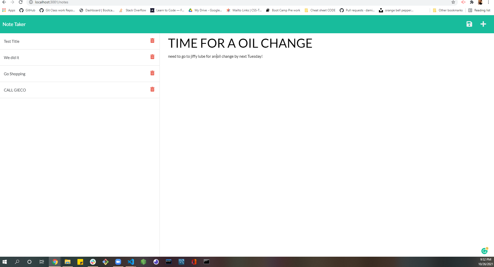

# Note-Taker

## Task: create an application called Note Taker that can be used to write and save notes. This application will use an Express.js back end and will save and retrieve note data from a JSON file.

## Languages / Systems used to complete this assignment

1. JavaScript
2. HTML
3. CSS
4. Git
5. Express

# screen shot

# links

- [deployed website](https://christophers-note-taker.herokuapp.com/)
- [repository](https://github.com/chris79kennard/Note-Taker)
